# A_Learned_representation_for_Artistic_Style_with_tensorflow-CIN-
For studying Neural Style Transfer

## Original papers

https://cs.stanford.edu/people/jcjohns/papers/eccv16/JohnsonECCV16.pdf

## Original code

https://github.com/tensorflow/magenta/tree/master/magenta/models/image_stylization

## Reference code

https://github.com/machrisaa/tensorflow-vgg

## Reference site

http://cocodataset.org/#home

## Environment

python = 3.6.8

tensorflow =1.13.1

opencv-python=3.4.2

numpy = 1.16.1

## How To Use It?

1. Go to tensorflow-vgg git, and make sure them run(I use VGG-19 and pretrained with imagenet)

2. Go to Ms-COCO Web Site and download COCO-Dataset 2014(because of use to training)

3. Check the images folder and read the Read.md

4. Make folder Named 'Model', 'Graph' and 'result'

5. Modify some code in train.py

  5.1. train.py : line 13 ~ 16
  
  5.2 Generate.py : line 21~28
  
6. Run train.py

## Result Example

 </img>
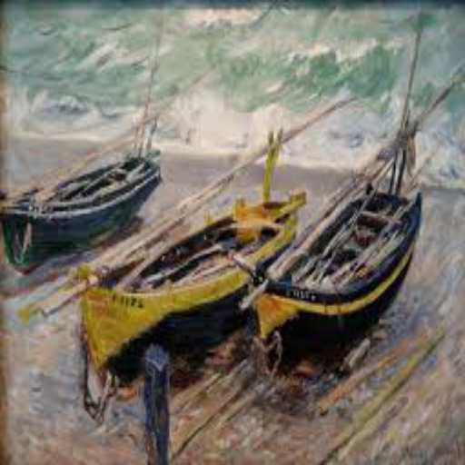 </img>
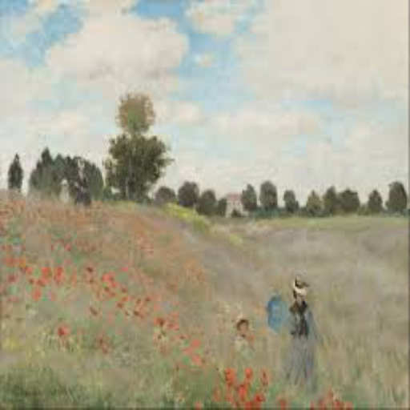 </img>
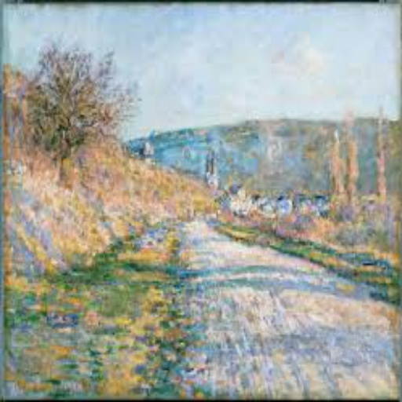 </img>

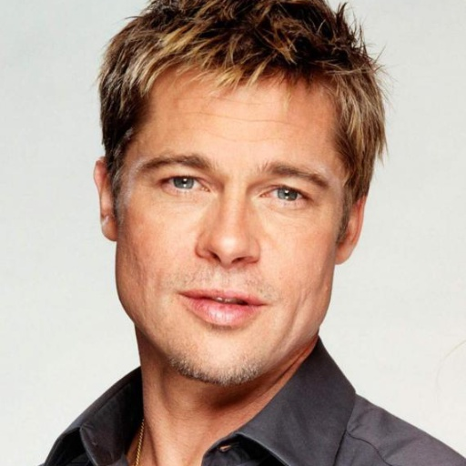 </img>
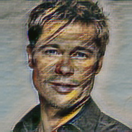 </img>
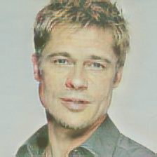 </img>
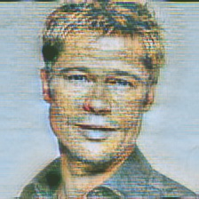 </img>

 </img>
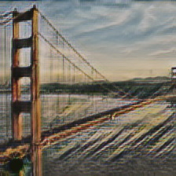 </img>
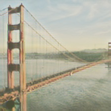 </img>
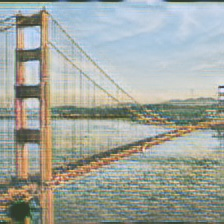 </img>

 </img>
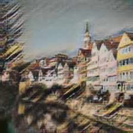 </img>
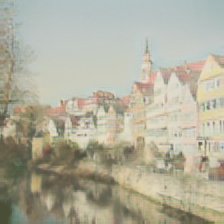 </img>
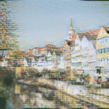 </img>

## Differences from the original

image size is 224,224(original 256,256)

I couldn't make select gamma and beta, so when you starting generate.py all style make stylized image
